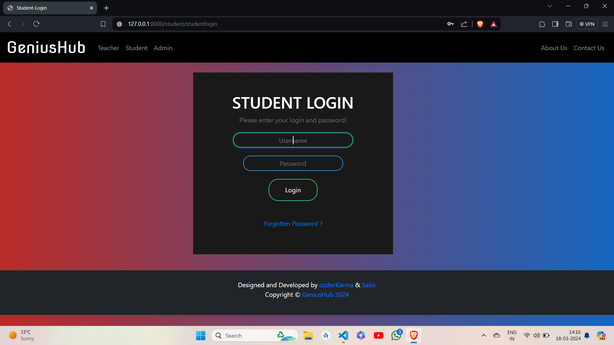
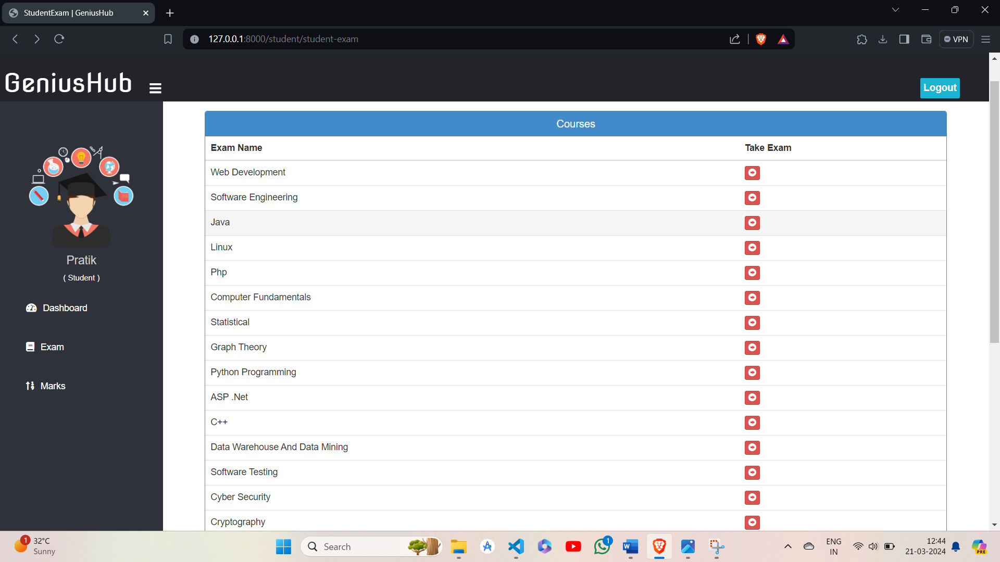

## GeniusHub

[](https://www.linkedin.com/in/shrinath-torangi)

Home Page 


Index Page


Login Page


Student Exams 


### Admin

- Create Admin account using command
python manage.py createsuperuser
  !!Remember the admin account can only be created in terminal using above command because django supports inbuilt admin and can't be created after hosting website.
- After Login, can see Total Number Of Student, Teacher, Course, Questions are there in system on Dashboard.
- Can View, Update, Delete, Approve Teacher.
- Can View, Update, Delete Student.
- Can Also See Student Marks.
- Can Add, View, Delete Course/Exams.
- Can Add Questions To Respective Courses With Options, Correct Answer, And Marks.
- Can View And Delete Questions Too.

### Teacher
- Apply for job in System. Then Login (Approval required by system admin, Then only teacher can login).
- After Login, can see Total Number Of Student, Course, Questions are there in system on Dashboard.
- Can Add, View, Delete Course/Exams.
- Can Add Questions To Respective Courses With Options, Correct Answer, And Marks.
- Can View And Delete Questions Too.

### Student
- Create account (No Approval Required By Admin, Can Login After Signup)
- After Login, Can See How Many Courses/Exam And Questions Are There In System On Dashboard.
- Can Give Exam Any Time, There Is No Limit On Number Of Attempt.
- Can View Marks Of Each Attempt Of Each Exam.
- Question Pattern Is MCQ With 4 Options And 1 Correct Answer.


## HOW TO RUN THIS PROJECT
- Install Python (Dont Forget to Tick Add to Path while installing Python)
- Open Terminal and Execute Following Commands :

python -m pip install -r requirements. txt (as these models are required to run the project)

- Download This Project Zip Folder and Extract it
- Move to project folder in Terminal. Then run following Commands :
```
python manage.py makemigrations (to look at any essential changes needed to do in the project)
python manage.py migrate (to apply the needed changes )
python manage.py runserver (to host the website on your PC'c localhost)
```
- Now enter following URL in Your Browser Installed On Your Pc
```
http://127.0.0.1:8000/
```
